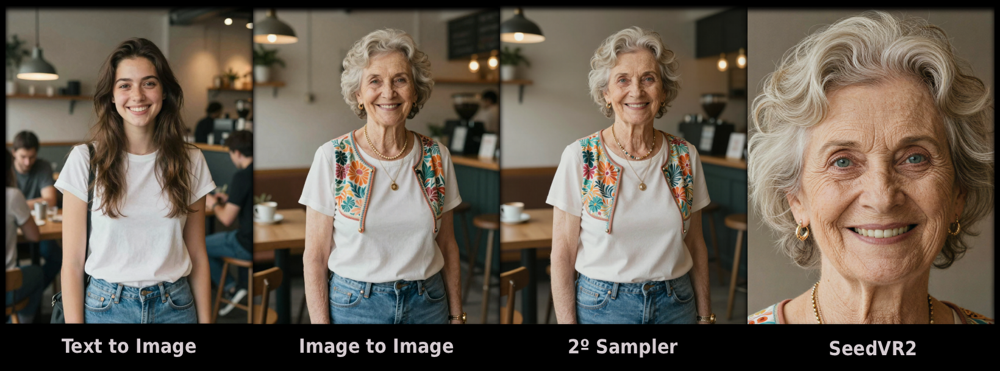
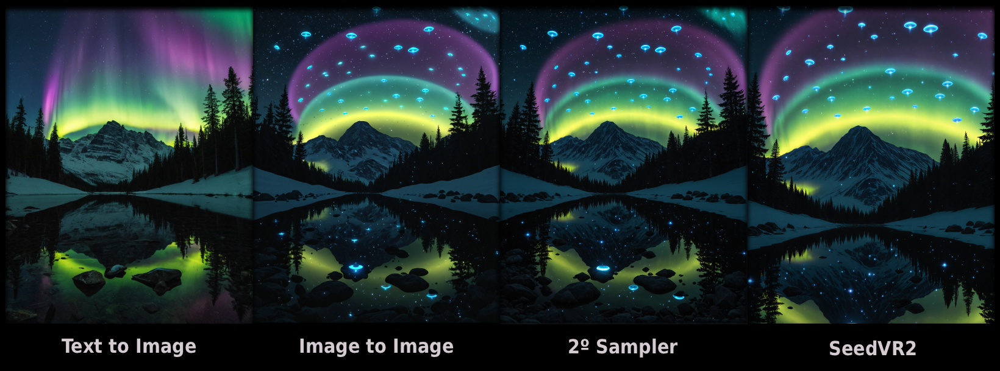
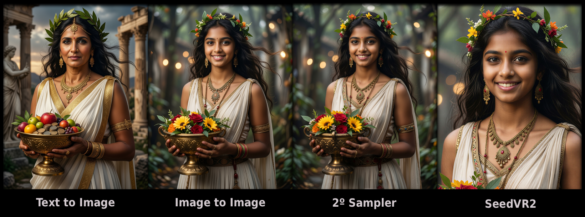
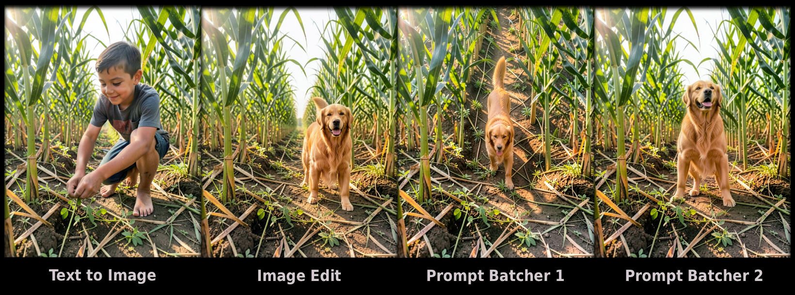
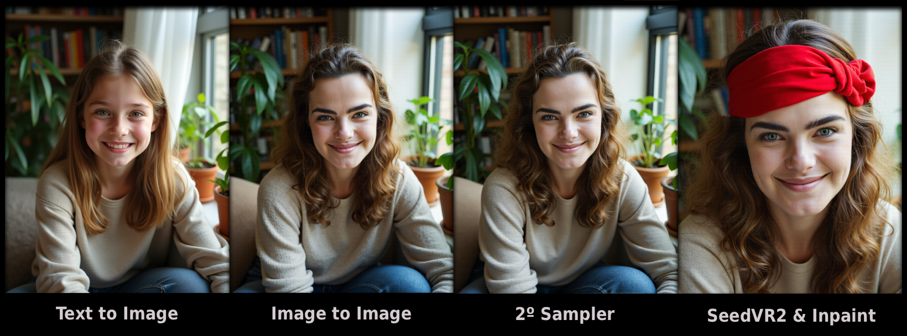
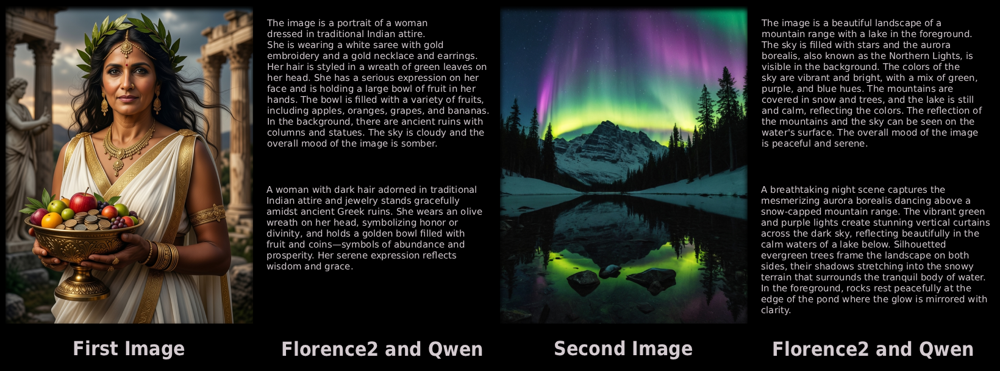

# ComfyUI Workflows
**My personal Workflows.**

This is simply a repository I decided to create to keep a copy of my ComfyUI Workflows, which I've been using for over two years. Furthermore, since I've learned so much from the community on Discord and Reddit, I'm happy to share it with everyone.

Feel free to use them and make your own customizations. Note that I am using GGUF models on my computer; change its nodes if you are using native models.

If you find something that could be improved and you'd like to share it with me, let me know here or through my Reddit by the username VictorDmAlves.

If you like to keep track of any changes that I make to the Workflows, be sure to Watch this repository on GitHub.

## Dependencies
I highly recommend using Straight lines in the "Lite Graph" settings, under the "Graph" section. Either this, or keep the lines invisible. My Workflows were built with this in mind.

To use this Workflows, install the following Custom_Nodes in your ComfyUI (you probably already have most of them):
- [ComfyUI Manager](https://github.com/Comfy-Org/ComfyUI-Manager).
- [Comfy-KepListStuff](https://github.com/M1kep/Comfy_KepListStuff).
- [ComfyUI's ControlNet Auxiliary Preprocessors](https://github.com/Fannovel16/comfyui_controlnet_aux).
- [ComfyUI Essentials](https://github.com/cubiq/ComfyUI_essentials).
- [ComfyUI-Detail-Daemon](https://github.com/Jonseed/ComfyUI-Detail-Daemon).
- [Florence2 in ComfyUI](https://github.com/kijai/ComfyUI-Florence2).
- [ComfyUI-GGUF](https://github.com/city96/ComfyUI-GGUF).
- [ComfyUI-Impact-Pack](https://github.com/ltdrdata/ComfyUI-Impact-Pack).
- [ComfyUI-Impact-Subpack](https://github.com/ltdrdata/ComfyUI-Impact-Subpack).
- [ComfyUI-Inspire-Pack](https://github.com/ltdrdata/ComfyUI-Inspire-Pack).
- [KJNodes for ComfyUI](https://github.com/kijai/ComfyUI-KJNodes).
- [QwenVL for ComfyUI](https://github.com/1038lab/ComfyUI-QwenVL).
- [ComfyUI-SeedVR2_VideoUpscaler](https://github.com/numz/ComfyUI-SeedVR2_VideoUpscaler).
- [ComfyUI Simple Prompt Batcher](https://github.com/ai-joe-git/ComfyUI-Simple-Prompt-Batcher).
- [ComfyUI-VideoHelperSuite](https://github.com/Kosinkadink/ComfyUI-VideoHelperSuite).
- [rgthree-comfy](https://github.com/rgthree/rgthree-comfy).
- [WAS Node Suite (Revised)](https://github.com/ltdrdata/was-node-suite-comfyui).
- [Z-Image Power Nodes](https://github.com/martin-rizzo/ComfyUI-ZImagePowerNodes).

## The Workflows

#### Z-Image-Turbo

This model is fast, but a little all over the place. Somewhat realistic and versatile. It's recommended to use the Z-Image for training, so I'm not going to build a Workflow for it; just using the Turbo one is enough and very competent nevertheless.

I've created this Workflows so far:
- TXT2IMG: A simple text to image using a custom_node with styles presets.
- IMG2IMG: A image to image with ControlNet implementation, if you want to make a very similar image.
- SeedVR2 Upscaler: First it runs through a second KSampler to add more details. After that, by enabling the group "SeedVR2", you can upscale the image.

Folder to the Workflows [Z-Image](./Workflows/Z-IMAGE/).
Folder with example [Images](./Images/Z-IMAGE/).

#### Wan 2.2

  
🎬 Example Video

  
  

  <video src="https://github.com/user-attachments/assets/a0dbcc65-0d17-4919-87fd-a60485ef7bca" width="70%" poster=""> </video>
  

Honestly, this model is extremely impressive. I'm surprised by its flexibility and realism, considering it's primarily a video model. That, and the vast collection of LoRAs available for it, makes it a very competent model for both image and video.

I've created this Workflows so far:
- TXT2IMG: A simple text to image using WanVideoNAG for better control.
- IMG2IMG: A image to image, but with no ControlNet of any kind yet (Wan has VACE; a different beast itself, I'm still messing around with it).
- TXT & IMG2VID: With the help of the 5B model, that can creat text or image to video, this Workflow allow you to generate a video with good length and quality. I've add the possibility to "stitch" two videos at one, making it seem like it's a continuous video.
- SeedVR2 Upscaler: Same as the others. First it runs through a second KSampler to add more details. After that, by enabling the group "SeedVR2", you can upscale the image.

Folder to the Workflows [Wan](./Workflows/WAN/).
Folder with example [Images and Video](./Images/WAN/).

#### SD-SDXL

One of the best models for producing illustrative and even realistic content. With its huge range of LoRAs and Checkpoints, and because it has been around for a while, it remains an indispensable model to this day, not to mention its speed.

I've created this Workflows so far:
- TXT2IMG: A simple text to image.
- IMG2IMG: A image to image with ControlNet implementation, if you want to make a very similar image.
- Inpaint: A Workflow that allows you to use Florence2 to mark the area that you want to be inpainted, or select a image and paint a mask yourself. Don't forget to use Checkpoints created specifically for inpaint.
- SeedVR2 Upscaler: Same as the others. First it runs through a second KSampler to add more details. After that, by enabling the group "SeedVR2", you can upscale the image.

Folder to the Workflows [SD-SDXL](./Workflows/SD-SDXL/).
Folder with example [Images](./Images/SD-SDXL/).

#### Qwen

Specifically speaking about the Qwen 2512, it's an extremely versatile model with excellent performance and prompt fixation. Using LoRAs Turbo, it's capable of producing very realistic images within few steps. It's one of my most frequently used model, which says a lot. I am messing around with the Qwen Image Edit 2511 model; I will implement a Workflow based on it in the near future.

I've created this Workflows so far:
- TXT2IMG: A simple text to image.
- IMG2IMG: A image to image with ControlNet implementation, if you want to make a very similar image.
- SeedVR2 Upscaler: Same as the others. First it runs through a second KSampler to add more details. After that, by enabling the group "SeedVR2", you can upscale the image.

Folder to the Workflows [Qwen](./Workflows/QWEN/).
Folder with example [Images](./Images/QWEN/).

#### Flux 2 Klein

This is the model that has impressed me the most so far. Extremely easy to use, it has spectacular quality and excellent speed. This model can make context-sensitive adjustments, very similar to Gemini and ChatGPT, which represents a major advance in the generation of images locally. Unfortunately, on my current machine, I can't use Flux2, only Klein. Maybe one day I'll upgrade and create Workflows for it; but in the current market situation, it will take a while.

In any of this Workflows, you can use either the 4B model or the 9B model; just don't forget to change the CLIP as well.

I've created this Workflows so far:
- TXT2IMG: A simple text to image, using the correct nodes for Flux2.
- Image Edit: This model is more refined than a image to image model. It allows for context-sensitive adjustments, including making adjustments to one image using a second image as a base.
- Prompt Batcher: This Workflow is excellent if you want to change an image multiple times, using different types of prompts, without needing to make one by one.
- SeedVR2 Upscaler: Just like before, but with a twist. First it runs through a second KSampler following your instructions (for reference I left one in the Workflow). After that, by enabling the group "SeedVR2", you can upscale the image.

Folder to the Workflows [Flux2](./Workflows/FLUX-2/).
Folder with example [Images](./Images/FLUX-2/).

#### Flux

My preferred model when it comes to realism and LoRA training. Besides being realistic, it can make changes to images, enlarge a photo, and contextually fill it with more information. A complete model, albeit a large one. I'm using Flux Fill as well, specially for outpainting.

Flux uses two CLIP, and its best application is to use short tags in "Clip-l" and detailed text in "T5".

I've created this Workflows so far:
- TXT2IMG: A simple text to image with the possibility to use Detail Daemon, which increase the details of the image.
- IMG2IMG: A image to image with ControlNet implementation, if you want to make a very similar image.
- Face Detailer: A Workflow that allows you to enhance a face in an image without altering other information. Useful for images of people at a distance, which often loses quality during image generation.
- Inpaint and Outpaint: I developed this Workflow to be as simple as possible. You choose an image, define whether you want to create a mask yourself or let Florence2 do it, then select whether you want to do inpaint or outpaint of the respective mask.
- XY Plot: I created this Workflow to compare and show, for example, the differences between a range of strength values of a LoRA. You can adapt this Workflow to make any other comparisons.
- SeedVR2 Upscaler: Same as the others. First it runs through a second KSampler to add more details. After that, by enabling the group "SeedVR2", you can upscale the image.

Folder to the Workflows [Flux](./Workflows/FLUX/).
Folder with example [Images](./Images/FLUX/).

#### Captions

For all LoRA training, I always used captions. Furthermore, it's possible to use them to extract information from images and use them to generate images.

Both Workflows are very similar; both have a way to caption one image or a batch of images, saving in a folder afterwards.

I've created this Workflows so far:
- Florence2: The most fast and consistent model to use. Sometimes it can be a little shallow in details, but nothing to bad.
- QwenVL: The most detailed model for captions, but it can hallucinate a lot and be very inconsistent. But you can give instructions on how to caption the images, just like ChatGPT; I've left a prompt in this Workflow for those who want to caption and train a LoRA.

Folder to the Workflows [Captions](./Workflows/CAPTIONS/).
Folder with example [Images and Captions](./Images/CAPTIONS/).