

# ComfyUI Workflows
**My personal Workflows.**

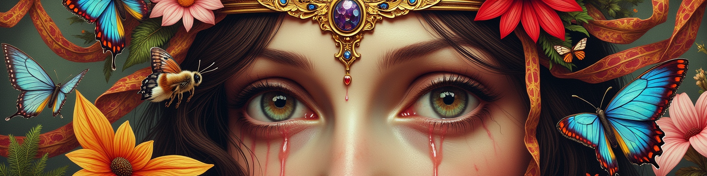

This is simply a repository I decided to create to keep a copy of my ComfyUI Workflows, which I've been using for years. Furthermore, since I've learned so much from the community on Discord and Reddit, I'm happy to share it with everyone.

Feel free to use them and make your own customizations. Note that I am using GGUF models on my computer; change its nodes if you are using native models.

If you find something that could be improved and you'd like to share it with me, let me know here or through my Reddit by the username VictorDmAlves.

If you like to keep track of any changes that I make to the Workflows, be sure to Watch this repository on GitHub.

## Dependencies
I highly recommend using Straight lines in the "Lite Graph" settings, under the "Graph" section. Either this, or keep the lines invisible. My Workflows were built with this in mind.

To use this Workflows, install the following custom_nodes in your ComfyUI (you probably already have some of them):
- [ComfyUI Manager](https://github.com/Comfy-Org/ComfyUI-Manager).
- [Comfy-KepListStuff](https://github.com/M1kep/Comfy_KepListStuff).
- [ComfyUI's ControlNet Auxiliary Preprocessors](https://github.com/Fannovel16/comfyui_controlnet_aux).
- [ComfyUI Essentials](https://github.com/cubiq/ComfyUI_essentials).
- [ComfyUI-Detail-Daemon](https://github.com/Jonseed/ComfyUI-Detail-Daemon).
- [Florence2 in ComfyUI](https://github.com/kijai/ComfyUI-Florence2).
- [ComfyUI-GGUF_KREA-2](https://github.com/RealRebelAI/ComfyUI-GGUF_KREA-2).
- [ComfyUI-Impact-Pack](https://github.com/ltdrdata/ComfyUI-Impact-Pack).
- [ComfyUI-Impact-Subpack](https://github.com/ltdrdata/ComfyUI-Impact-Subpack).
- [ComfyUI-Inspire-Pack](https://github.com/ltdrdata/ComfyUI-Inspire-Pack).
- [KJNodes for ComfyUI](https://github.com/kijai/ComfyUI-KJNodes).
- [QwenVL for ComfyUI](https://github.com/1038lab/ComfyUI-QwenVL).
- [ComfyUI-SeedVR2_VideoUpscaler](https://github.com/numz/ComfyUI-SeedVR2_VideoUpscaler).
- [ComfyUI Simple Prompt Batcher](https://github.com/ai-joe-git/ComfyUI-Simple-Prompt-Batcher).
- [ComfyUI-VideoHelperSuite](https://github.com/Kosinkadink/ComfyUI-VideoHelperSuite).
- [rgthree-comfy](https://github.com/rgthree/rgthree-comfy).
- [WAS Node Suite (Revised)](https://github.com/ltdrdata/was-node-suite-comfyui).
- [Z-Image Power Nodes](https://github.com/martin-rizzo/ComfyUI-ZImagePowerNodes).
- [ComfyUI WD 1.4 Tagger](https://github.com/pythongosssss/ComfyUI-WD14-Tagger).
- [ComfyUI_UltimateSDUpscale](https://github.com/ssitu/ComfyUI_UltimateSDUpscale).
- [ComfyUI Layer Style](https://github.com/chflame163/ComfyUI_LayerStyle).
- [Kiko Prompt Builder](https://github.com/ComfyAssets/kiko-flux2-prompt-builder).

## Tips and Tricks
- Change Models: In all my Workflows, you will see that is included a SeedVR2 Workflow for all models. In addition to the features it provides, it can be used to transform an image into another image using a different model thanks to the second KSampler. For instance, you can take an image created in Z-Image-Turbo and place it directly into Flux's SeedVR2. Not only will it transform the image into a Flux image, but it will also allow you to maintain the similarity between the models as much as possible.
- Swap Characters: For Flux2 Klein, let's say that you want to swap characters between X (real life photo) with Y (art style photo). It's better to replace the background of X to a white color, then change his style to be exactly the same art style of Y to finaly ask Klein to, with this two changes done, swap X with Y, keeping the same pose if you like. Thanks to [arthan1011](https://www.reddit.com/r/comfyui/comments/1qs2h6p/replace_this_character_workflow_with_flux2_klein/) for this find.
- Upscale technique for Flux and Flux2: For both of this models, has a technique to upscale a image using tiles together with SeedVR2. Because it divides the image into tiles, performing individual upscaling, when everything is combined into a single image, the result is truly impressive. Thanks to [Wei Mao](https://www.youtube.com/watch?v=QHn6Qg59e8Y) for this find.
- Two LoRA in one image: Recently I discovered Illustrious model and fell in love with the SDXL again (I believe Anima helped me with that). That said, I was curious to know if there was a way to place two LoRAs of different characters in a single image, using only one KSampler, without creating artifacts or duplicates. Here's the Workflow with Hooks, a technique that consists of rendering each LoRA in a piece of the image using masks, combining them afterwards. Thanks to [Nikhil Setiya](https://www.youtube.com/watch?v=zhJJcegZ0MQ) for this find.

Folder with examples of this [Tips and Tricks](./Images/EXAMPLES/).

## The Workflows

#### Z-Image-Turbo
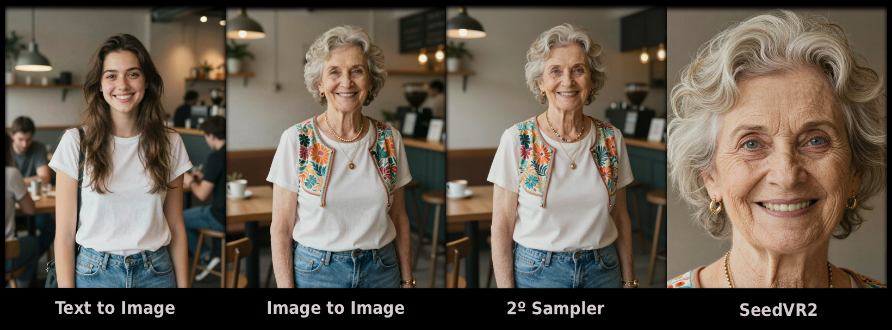

My new favorite model, both for its speed and for its quality, fixation and consistency. Really versatile. It's recommended to use the Z-Image Base for training, so I'm not going to build a Workflow for it; just using the Turbo one is enough and very competent nevertheless. I'm loving creating LoRAs for this model; hope to share with you all someday in the future.

I am starting to use Wildcards to create custom, dynamic images. To that end, I am also attaching the [Wildcards](.Wildcards/) I use for Z-Image-Turbo (they work with other models as well).

I have included further instructions on how to use them within the Workflows. I am still getting used to this system; I will update the other Workflows as soon as possible.

I've created this Workflows so far:
- TXT2IMG: A simple text to image using a custom_node with styles presets and Wildcard support.
- IMG2IMG: A image to image with ControlNet implementation, if you want to make a very similar image.
- Inpaint: I developed this Workflow to be as simple as possible. You choose an image, define whether you want to create a mask yourself or let Florence2 do it, then proceed with the inpaint when you ready.
- SeedVR2 Upscaler: First it runs through a second KSampler to add more details. After that, by enabling the group "SeedVR2", you can upscale the image.
- Tile and SeedVR2 Upscaler: An impressive way to improve an image by dividing it into tiles, upscaling each tile individually, thus unifying them and creating a single image with superior quality compared to any other type of upscaling technique.
- XY Plot: I created this Workflow to compare and show, for example, the differences between a range of strength values of a LoRA. You can adapt this Workflow to make any other comparisons.

Folder to the Workflows [Z-Image](./Workflows/Z-IMAGE/).
Folder with example [Images](./Images/Z-IMAGE/).

#### Wan 2.2

  
🎬 Example Video

  
  

  <video src="https://github.com/user-attachments/assets/a0dbcc65-0d17-4919-87fd-a60485ef7bca" width="70%" poster=""> </video>
  

Honestly, this model is extremely impressive. I'm surprised by its flexibility and realism, considering it's primarily a video model. That, and the vast collection of LoRAs available for it, makes it a very competent model for both image and video.

I've created this Workflows so far:
- TXT2IMG: A simple text to image using WanVideoNAG for better control.
- IMG2IMG: A image to image, but with no ControlNet of any kind yet (Wan has VACE; a different beast itself, I'm still messing around with it).
- TXT & IMG2VID: With the help of the 5B model, that can creat text or image to video, this Workflow allow you to generate a video with good length and quality. I've add the possibility to "stitch" two videos at one, making it seem like it's a continuous video.
- SeedVR2 Upscaler: Same as the others. First it runs through a second KSampler to add more details. After that, by enabling the group "SeedVR2", you can upscale the image.

Folder to the Workflows [Wan](./Workflows/WAN/).
Folder with example [Images and Video](./Images/WAN/).

#### SD-SDXL
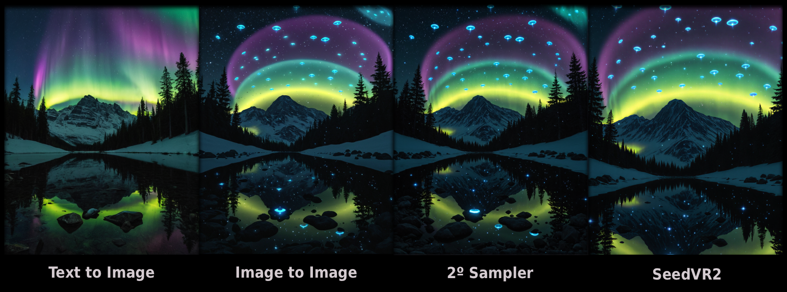

One of the best models for producing illustrative and even realistic content. With its huge range of LoRAs and Checkpoints, and because it has been around for a while, it remains an indispensable model to this day.

I've created this Workflows so far:
- TXT2IMG: A simple text to image.
- IMG2IMG: A image to image with ControlNet implementation, if you want to make a very similar image.
- Inpaint & Outpaint: I developed this Workflow to be as simple as possible. You choose an image, define whether you want to create a mask yourself or let Florence2 do it, then select whether you want to do inpaint or outpaint of the respective mask.
- Two LoRA Hooks: This Workflow helps generate an image using two distinct LoRAs together, without creating artifacts or duplicates. You can combine two characters, two image styles, or two pose styles.
- SeedVR2 Upscaler: Same as the others. First it runs through a second KSampler to add more details. After that, by enabling the group "SeedVR2", you can upscale the image.
- Tile and SeedVR2 Upscaler: An impressive way to improve an image by dividing it into tiles, upscaling each tile individually, thus unifying them and creating a single image with superior quality compared to any other type of upscaling technique.
- XY Plot: I created this Workflow to compare and show, for example, the differences between a range of strength values of a LoRA. You can adapt this Workflow to make any other comparisons.

Folder to the Workflows [SD-SDXL](./Workflows/SD-SDXL/).
Folder with example [Images](./Images/SD-SDXL/).

#### Qwen2511 Image Edit
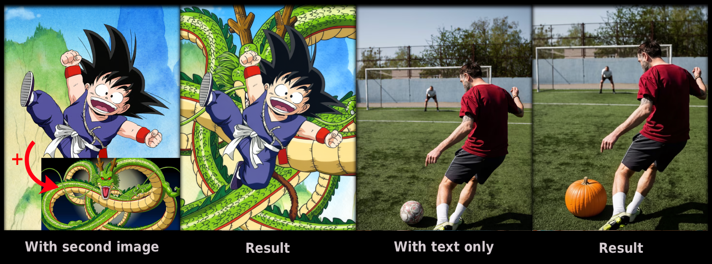

One of the few local models that can edit an image using contextual language. Compared to the Flux2 Klein, this model takes longer to edit a image and it has a few flaws; for instance, you can't change the style of one image using another (I recommend using LoRA for this). But in terms of consistency in a person's anatomy, this one is more efficient. Overall, a very powerful model.

I've created this Workflows so far:
- Image Edit: This model is more refined than a image to image model. It allows for context-sensitive adjustments, including making adjustments to one image using a second image as a base. I've added a Simple Prompt Batcher so you can change an image multiple times, using different types of prompts, without needing to make one by one.

Folder to the Workflows [Qwen](./Workflows/QWEN/).
Folder with example [Images](./Images/QWEN/).

#### Qwen2512
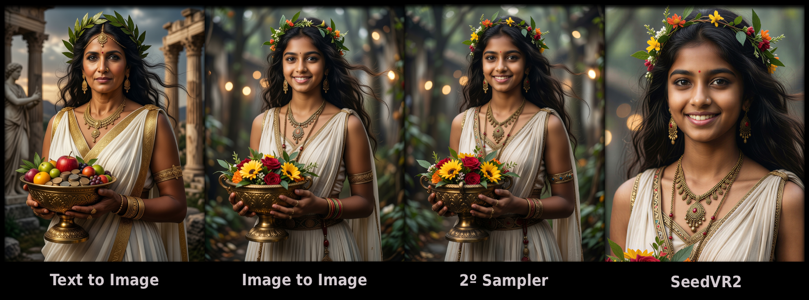

It's an extremely versatile model with excellent performance and prompt fixation. Using LoRAs Turbo, it's capable of producing very realistic images within few steps. It's one of my most frequently used model, which says a lot.

I've created this Workflows so far:
- TXT2IMG: A simple text to image.
- IMG2IMG: A image to image with ControlNet implementation, if you want to make a very similar image.
- SeedVR2 Upscaler: Same as the others. First it runs through a second KSampler to add more details. After that, by enabling the group "SeedVR2", you can upscale the image.

Folder to the Workflows [Qwen](./Workflows/QWEN/).
Folder with example [Images](./Images/QWEN/).

#### Flux2 Krea
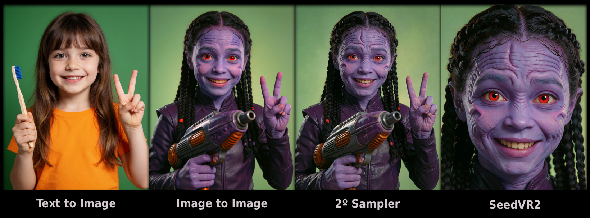

Although I categorize it as Flux2 in my Workflows, it is a model trained from scratch that uses Qwen3-VL as the text encoder and the Qwen Image VAE for decoding. I am using the "Turbo" version and am quite impressed with its quality and speed.

This model can also interpret JSON files containing bboxes (bounding boxes in rectangles shapes), much like Ideogram 4.0, although both, of course, yield results that are quite different from one another.

To use this model with GGUF, you need a specific custom_node, a fork of "city96/ComfyUI-GGUF" which supplements the original node, given that the author hasn't updated that project in months. I replaced it with this new one in my Workflows!

I am still learning how to use it more effectively; I haven't implemented anything with ControlNet yet, for example. But one step at a time!

I've created this Workflows so far:
- TXT2IMG: A simple text to image using a custom_node with styles presets and more.
- IMG2IMG: A image to image implementation.
- SeedVR2 Upscaler: Same as the others. First it runs through a second KSampler to add more details. After that, by enabling the group "SeedVR2", you can upscale the image.
- Tile and SeedVR2 Upscaler: An impressive way to improve an image by dividing it into tiles, upscaling each tile individually, thus unifying them and creating a single image with superior quality compared to any other type of upscaling technique.

Folder to the Workflows [Flux2](./Workflows/FLUX-2/).
Folder with example [Images](./Images/FLUX-2/).

#### Flux2 Klein
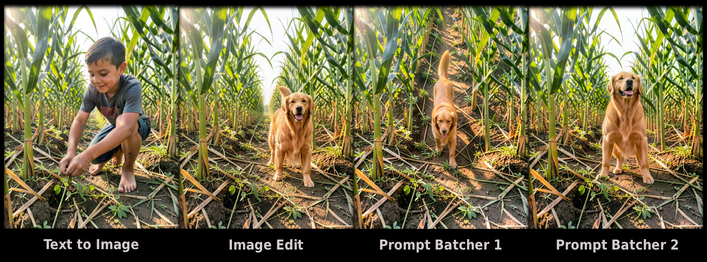

This is the model that has impressed me the most so far. Extremely easy to use, it has spectacular quality and excellent speed. This model can make context-sensitive adjustments, very similar to Gemini and ChatGPT, which represents a major advance in the generation of images locally. Unfortunately, on my current machine, I can't use Flux2, only Klein. Maybe one day I'll upgrade and create Workflows for it; but in the current market situation, it will take a while.

In any of this Workflows, you can use either the 4B model or the 9B model; just don't forget to change the CLIP for them as well.

I've created this Workflows so far:
- TXT2IMG: A simple text to image using a custom_node with styles presets and more.
- Image Edit: This model is more refined than a image to image model. It allows for context-sensitive adjustments, including making adjustments to one image using a second image as a base. I've added a Simple Prompt Batcher so you can change an image multiple times, using different types of prompts, without needing to make one by one.
- Image Edit in Bulk: For instance, if you want to remove watermarks from images and don't want to do it one by one, this Workflow will help make the task easier and more automated.
- SeedVR2 Upscaler: Just like before, but with a twist. First it runs through a second KSampler following your instructions (for reference I left one in the Workflow). After that, by enabling the group "SeedVR2", you can upscale the image.
- Tile and SeedVR2 Upscaler: An impressive way to improve an image by dividing it into tiles, upscaling each tile individually, thus unifying them and creating a single image with superior quality compared to any other type of upscaling technique.

Folder to the Workflows [Flux2](./Workflows/FLUX-2/).
Folder with example [Images](./Images/FLUX-2/).

#### Flux
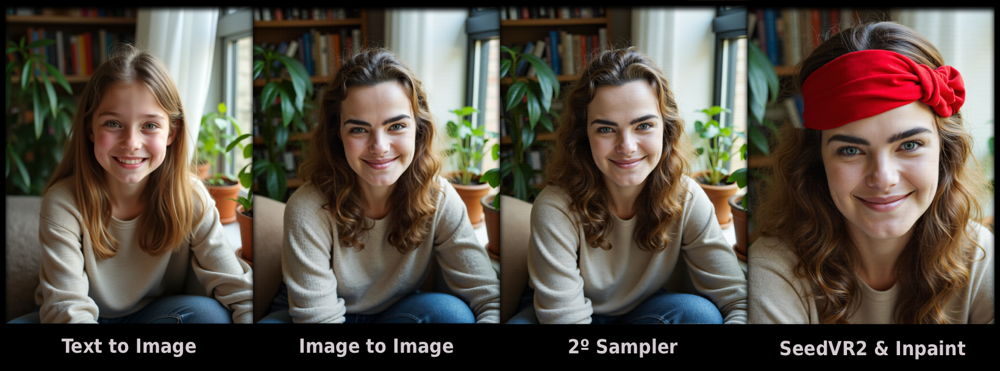

Used to be my preferred model when it comes to realism and LoRA training, although I haven't stopped using it here and there. Besides being realistic, it can make changes to images, enlarge a photo, and contextually fill it with more information. A complete model, albeit a large one. I'm using Flux Fill as well, specially for outpainting.

Flux uses two CLIP, and its best application is to use short tags in "Clip-l" and detailed text in "T5".

I've created this Workflows so far:
- TXT2IMG: A simple text to image with the possibility to use Detail Daemon, which increase the details of the image.
- IMG2IMG: A image to image with ControlNet implementation, if you want to make a very similar image.
- Face Detailer: A Workflow that allows you to enhance a face in an image without altering other information. Useful for images of people at a distance, which often loses quality during image generation.
- Inpaint and Outpaint: I developed this Workflow to be as simple as possible. You choose an image, define whether you want to create a mask yourself or let Florence2 do it, then select whether you want to do inpaint or outpaint of the respective mask.
- Ultimate SD Upscaler: For those who prefer the inference, dividing by blocks, and quality control of this upscaler. I would say that, for some cases, this one is still the best; though your mileage may vary.
- SeedVR2 Upscaler: Same as the others. First it runs through a second KSampler to add more details. After that, by enabling the group "SeedVR2", you can upscale the image.
- Tile and SeedVR2 Upscaler: An impressive way to improve an image by dividing it into tiles, upscaling each tile individually, thus unifying them and creating a single image with superior quality compared to any other type of upscaling technique.
- XY Plot: I created this Workflow to compare and show, for example, the differences between a range of strength values of a LoRA. You can adapt this Workflow to make any other comparisons.

Folder to the Workflows [Flux](./Workflows/FLUX/).
Folder with example [Images](./Images/FLUX/).

#### Ideogram 4.0
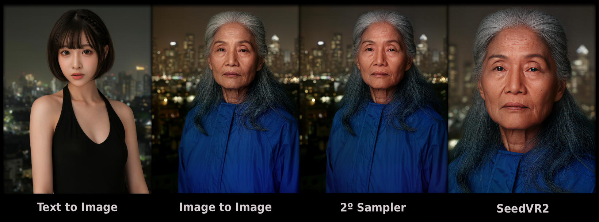

Another model with a bright future, although it's quite slow and a bit complicated for generating prompts; at that note, use my QwenVL Workflow with the guided text mentioned in the [Ideogram4](.Ideogram4/Generate_Prompt.txt) file to generate a prompt with LLM in JSON format, since this model required one.

The great advantage of this model is that it's possible to use bboxes (bounding boxes in rectangles shapes) to specify where each object is located in the scene, which is quite impressive; the model quality is excellent.

I separated the Prompt Builder part using Kjnodes because – if you have other models that use Qwen as CLIP – you can use this Workflow to generate the JSON format for them as well (like Flux2 Klein).

You'll notice that I didn't use the two Ideogram models (normal and unconditional) since I obtained better results without the latter; I'm also not using GGUF, only for the CLIP, mainly because it's not yet supported in ComfyUI.

I've created this Workflows so far:
- TXT2IMG: A simple text to image.
- IMG2IMG: A image to image implementation.
- Prompt Builder: A simple way to load an image or a prompt, converting it to text in JSON format; it's also possible to create all the bboxes within this Workflow.
- SeedVR2 Upscaler: Same as the others. First it runs through a second KSampler to add more details. After that, by enabling the group "SeedVR2", you can upscale the image.

Folder to the Workflows [Ideogram](./Workflows/IDEOGRAM-4/).
Folder with example [Images](./Images/IDEOGRAM-4/).

#### Anima
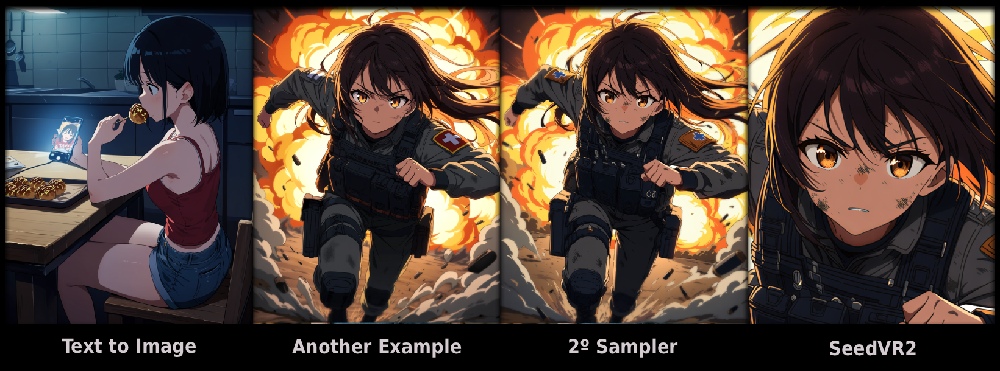

This is an extraordinary model that the folks at CircleStone Labs are developing in collaboration with Comfy Org. It is currently in base version 1.0 and has variations like the "Aesthetic" and "Turbo" versions (the latter of which I recommend using).

I see a lot of potential for the model, especially when it comes to overall quality and fixation for generating anime-style images (in some cases, even for realistic images). I'm studying a way to use ControlNet for image to image; almost there.

I recommend checking out their [page](https://huggingface.co/circlestone-labs/Anima) for more information about prompts and tags.

I've created this Workflows so far:
- TXT2IMG: A simple text to image (I put the Turbo version separately).
- IMG2IMG: A image to image implementation.
- SeedVR2 Upscaler: Same as the others. First it runs through a second KSampler to add more details. After that, by enabling the group "SeedVR2", you can upscale the image.
- Tile and SeedVR2 Upscaler: An impressive way to improve an image by dividing it into tiles, upscaling each tile individually, thus unifying them and creating a single image with superior quality compared to any other type of upscaling technique.

Folder to the Workflows [Anima](./Workflows/ANIMA/).
Folder with example [Images](./Images/ANIMA/).

#### Captions
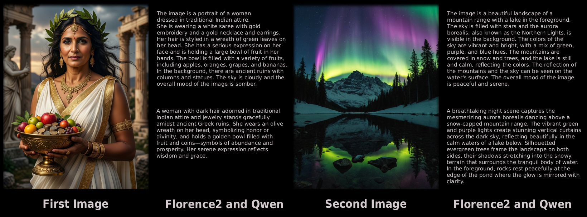

For all my LoRA training, I always used captions. Furthermore, one of its uses is to analyze any image and generate a prompt to be used in image generation.

This Workflows are very similar; they have a way to caption one image or a batch of images, saving them in a folder afterwards.

I've created this Workflows so far:
- Florence2: The most fast and consistent model to use. Sometimes it can be a little shallow in details, but it still the best in my opinion.
- QwenVL: The most complete model for captions, but it can hallucinate a lot and be very inconsistent. One of the best things about it is that you can give instructions on how to caption an image, just like ChatGPT; I left a instruction as example within this Workflow.
- WD 1.4 Tagger: The go-to model if you want to produce captions with danbooru-style tags.

Folder to the Workflows [Captions](./Workflows/CAPTIONS/).
Folder with example [Images and Captions](./Images/CAPTIONS/).